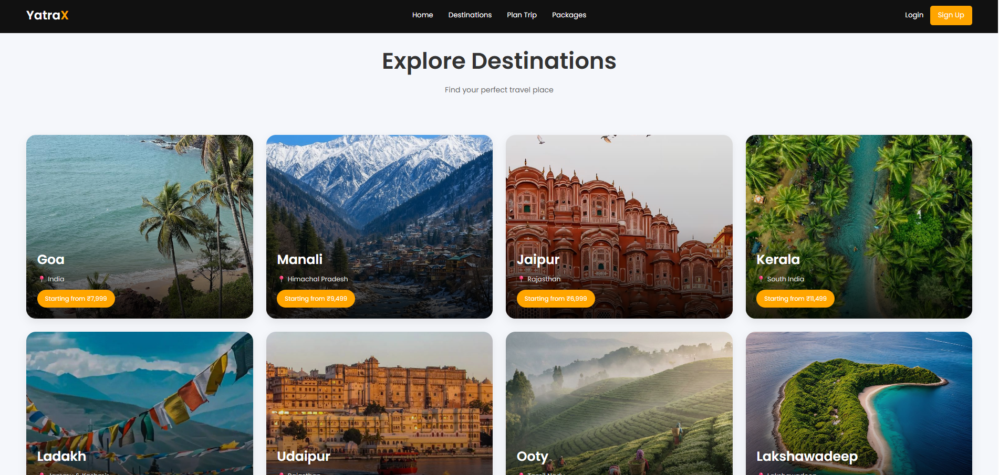
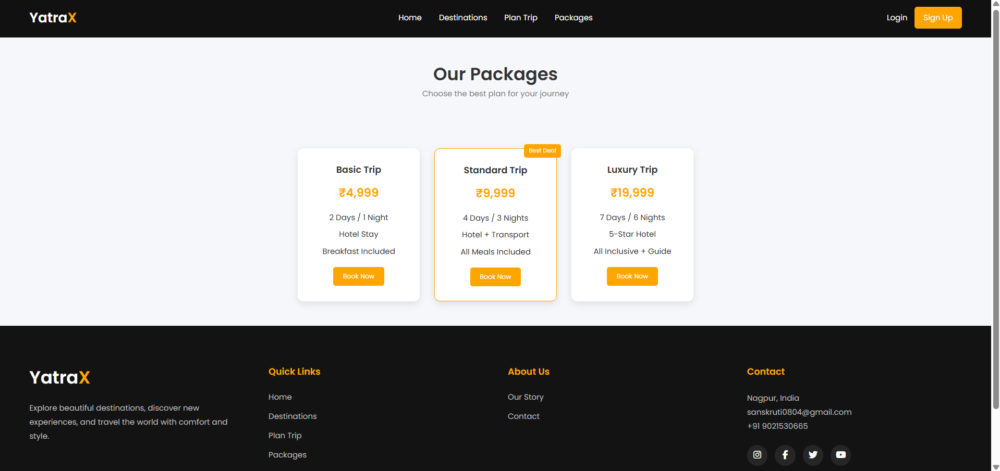

# YatraX - Travel Website

YatraX is a responsive travel website that helps users explore destinations, discover travel packages, and plan their trips through a modern and user-friendly interface.

## Features

- Responsive travel website design
- Destination showcase with pricing details
- Trip planning section
- Travel packages display
- About and Contact pages
- Mobile-friendly layout

## Technologies Used

- HTML5
- CSS3
- Google Fonts
- Font Awesome

## Project Preview

## What I Learned

- Creating responsive multi-page websites
- Using CSS layouts, media queries, and hover effects
- Organizing files and reusable components
- Improving UI design and user experience

## Author

Sanskruti Chikhlonde

**GitHub:** https://github.com/sanskruti-chikhlonde/YatraX

**Live Website:** https://yatra-x.netlify.app/